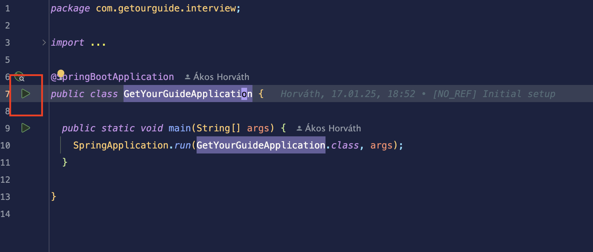

# Software Engineer Backend Coding Interview

## Requirements
* JDK 21

## Local Setup

### Running the Application using IntelliJ IDEA

1. Clone this repository
2. Import the project as a new project in IntelliJ
3. Navigate to `GetYourGuideApplication.java` and run the main method by clicking the top green arrow on the left side of the editor.

### Running the Application using Gradle

ℹ️ Note: We recommend running the application using IntelliJ IDEA so you can leverage its debug tooling.

1. Clone this repository
2. Navigate to the project directory in your terminal
3. Run the following command: `./gradlew bootRun`

### Running the application using another IDE
You are welcome to use any IDE of your preference to run the application. As long as you are able to execute the application, access its endpoints, and utilize a debugger if necessary, we support the use of any IDE that meets these requirements. Please bear in mind that your interviewer may not be familiar with your IDE, so may not be able to support you as effectively during the interview if necessary.

The application endpoints will be accessible on `http://localhost:8080/`.

### My Notes

This is an exercise in debugging a Spring Boot application with a runtime error.
The existing tests pass and the application server starts correctly. The code coverage from tests is moderate, which could be a second problem for this quiz.
For me, it is also an exercise in installing, configuring and running IntelliJ IDEA Community edition.
I chose the IDE package from the Ubuntu Snap store, as it has the same version as the downloadable release.
I also installed Gradle through the snap store. This is different than the version of Gradle IntelliJ installs, which seems to be coupled to a configuration file. # TODO, what is the name of this file and the meaning of its contents?

The test coverage tool in IDEA shows that only one out of two controllers has test coverage. It also only has 20% method coverage. I don't know what Line coverage is.
The service also has low-ish method coverage but that might not be helpful for this quiz. In this case, the SupplierController has no test coverage. START THERE.

The tests might depend on a test database being seeded. Spring Boot automatically runs migrations at application boot time. The controller tests currently only assert True. These tests can be generated from Augment.

The Community edition of IDEA has puzzlingly disabled features. For example, it will display the contents of SQL and java .properties files but pops up a warning that these files are "not supported". How are they not supported if I can view them?

The SuppliersController has a JSON formatting error. It outputs bad information. Compare the JSON output of http://localhost:8080/suppliers to the output of http://localhost:8080/activities

This is probably easy to fix visually but...let's let our AI assistant do it! Why isn't there a JSON validator here? This reminds me of the Astranis coding interview round two where I was asked to "dive into a JSON" without using the jsonschema library.

The source of the problem seems to be that the SupplierController and the ActivitiesController use two different types of persistence. The SupplierController uses a native query and the ActivitiesController uses a repository.
The imports of jakarta.persistence.EntityManager and the PersistenceContext seem to be different than the imports of ActivityDto and ActivityService. What does this mean?

The SupplierController has a different naming convention from the ActivitiesController. Renaming it to follow the conventions.

the java package at com.getourguide.interview appears to be named incorrectly. What are the consequences of renaming it to getyoutguide?

**Open questions**

1. Q: How do I locate the runtime error?
    A: Load the /suppliers endpoint.
2. How do I fix the runtime error?
    A: Add a Data Transport Object based on a reference from the ActivitiesController. Keep the Service Layer and MVC petterns for the Suppliers
3. Q: How do determine if there are other runtime errors?
    A: Run tests
4. How do I expand the test coverage to check for the discovered runtime errors?
    A: Augment generated some tests
5. Q: How do I verify the test database is seeded?
    A: use `java -cp ~/.gradle/caches/modules-2/files-2.1/com.h2database/h2/2.3.232/4fcc05d966ccdb2812ae8b9a718f69226c0cf4e2/h2-2.3.232.jar org.h2.tools.Shell` to execute an interactive shell. Use SQL to verify tables and data exist. There is also a webapp explorer at `http://localhost:8080/h2-console`